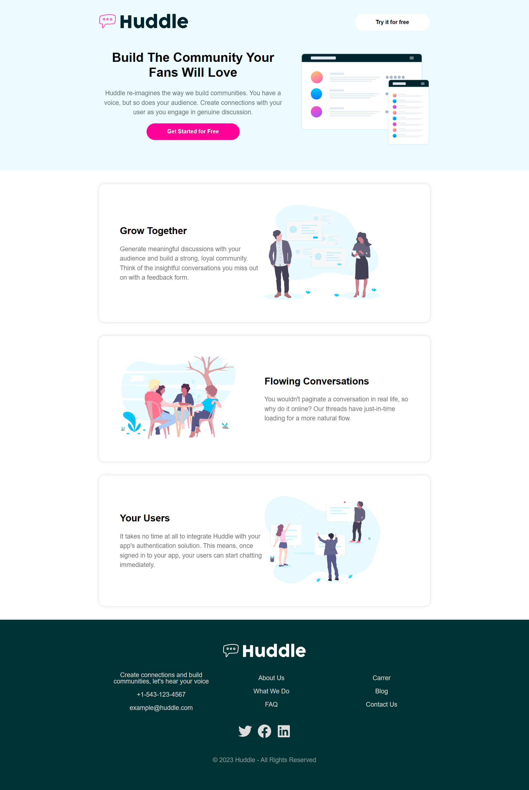
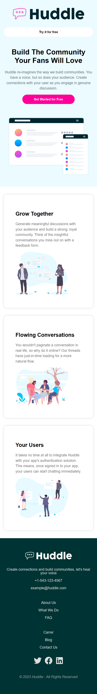

## Huddle - Landing Page

- Create with ReactJS and Styled Components
- Font Awesome icons pack in React Icons
    - [https://react-icons.github.io/react-icons/icons?name=fa](https://react-icons.github.io/react-icons/icons?name=fa)

Install dependencies and run the project: 
```
npm install
npm start
```

---

### 👁️ [View Online](https://huddlelp.vercel.app/)

---

#### Desktop view:


---

#### Mobile view:

